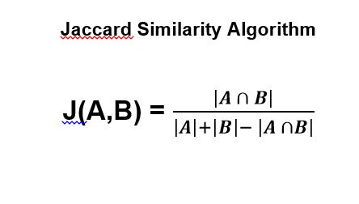

# Introduction
Among people and their friends, they want to identify how much they have in common. Activities, hobbies, beliefs, courses taken, interests are what binds students together. Intuitively, it is hard to fully grasp the degree to which friends are alike quantitatively. To take aim at this problem, it is possible to take a person’s range of stuff they like to do or have done and compare that list with their friend’s. This comparison can be run through an algorithm known as Jaccard Similarity Index which produces a score that determines how much alike a person is to their friend. 

### Function Design Hierachy

The diagram above shows all of the functions that are included to build this Python script. The **first_list()** function asks the user to input their range of interests, hobbies, or courses taken. Similarly, **second_list()** prompts the user to input their friend’s range of interests, hobbies, or courses taken. Both functions store inputs into an array for which if the list exceeds five string values, the while loop will break. The **jaccard_similarity()** function takes the inputs from both lists and produces a score for which is ranked by a if-elif-else statements. The **main()** function nests all of these functions. 

## Main() Function Design 
)

The diagram above shows the logic of how the functions nested within main() function operates.  
